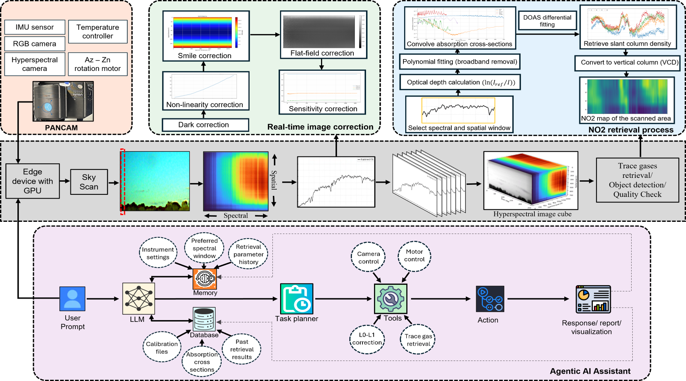
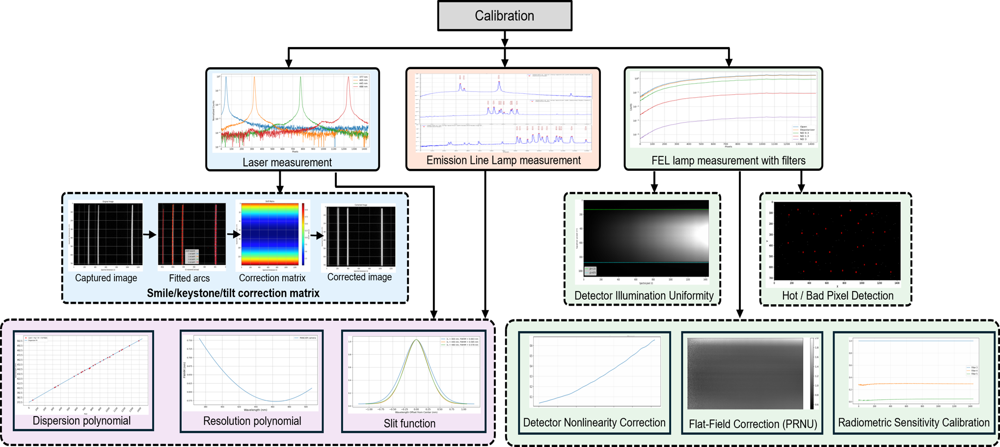
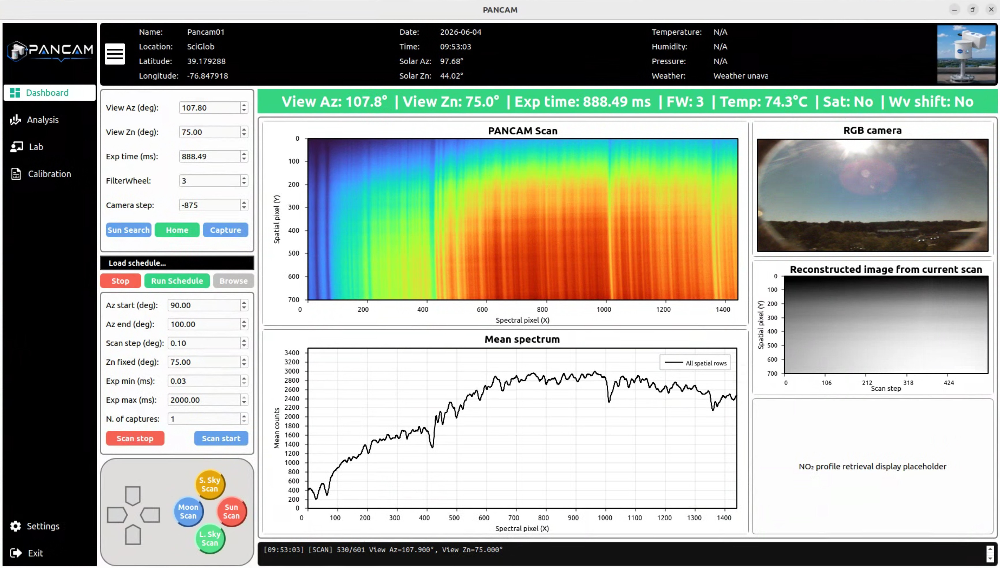
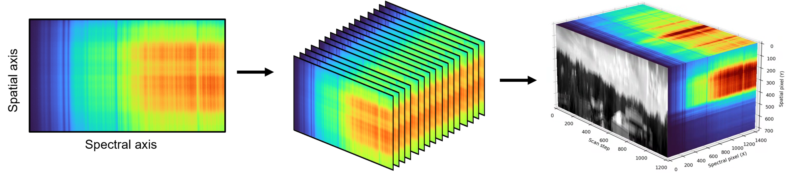
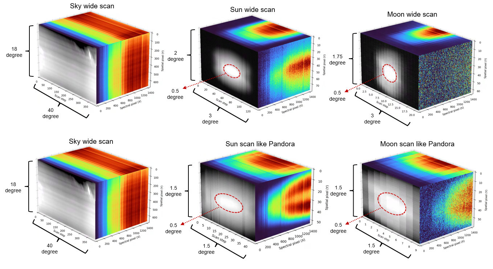

<table>
<tr>
<td width="110">

</td>

<td>

# PANCAM Hyperspectral Imaging for Atmospheric Gas Retrieval

**NASA SBIR Sponsored Project**

A compact hyperspectral imaging system for atmospheric remote sensing, designed to measure real-time trace gases such as nitrogen dioxide (NO₂) from ground-based observations.

</td>
</tr>
</table>

---

## Overview

PANCAM is a hyperspectral imaging instrument that combines precision optics, automated calibration, advanced spectral processing, and AI-assisted software to perform Real-time atmospheric gas retrievals.

The project includes:

- Hyperspectral image acquisition
- Instrument calibration and characterization
- Level-0 (raw) to Level-1 (radiometrically calibrated) processing
- Differential Optical Absorption Spectroscopy (DOAS) based Level-2 NO₂ retrieval
- Real-time instrument control and visualization
- Agentic AI assistant for automated analysis, diagnostics, and workflow support

---

# Framework

The overall processing workflow from instrument calibration to atmospheric gas retrieval.

---

# Calibration

Accurate calibration is essential for quantitative atmospheric retrievals.

PANCAM is calibrated using several laboratory light sources, including:

- Laser sources for spectral resolution and wavelength calibration
- Mercury (Hg) lamp
- Krypton (Kr) lamp
- Xenon (Xe) lamp
- Integrating sphere and calibrated lamps for radiometric calibration
- Flat-field and detector characterization measurements

The resulting calibration products are used to convert the raw Level-0 measurements into calibrated Level-1 spectra, which are subsequently used for Level-2 atmospheric gas retrievals.

---

# PANCAM Operation Software

The PANCAM software provides an integrated graphical user interface (GUI) for instrument operation, including:

- Camera, Motor and Filter wheel control
- Automated scanning
- Live RGB preview
- Hyperspectral image acquisition
- Reconstruct scanned area image
- Calibration workflows
- Real-time L1 and L2 data conversion and visualization
- Data processing and export

---

# Hyperspectral Image Cube

Each scan is reconstructed into a hyperspectral image cube containing two spatial dimensions and one spectral dimension, enabling detailed spectral analysis for every image pixel.

---

# Sky, Sun and Moon Imaging

PANCAM supports multiple observation geometries, including sky scans, direct Sun observations, and Moon measurements for atmospheric monitoring under different illumination conditions.

---

# Agentic AI Assistant

The PANCAM software integrates an Agentic AI Assistant to improve instrument usability and data analysis.

Features include:

- Instrument diagnostics
- Calibration guidance
- Automated quality assessment
- Retrieval troubleshooting
- Software assistance
- Scientific workflow support
- Natural language interaction for data analysis and visualization

---

## Project Status

🚧 This repository is under active development. New features, calibration improvements, and retrieval algorithms are continuously being added.
If you need more information or full code, please contact: 

Muntasir Mahmud

AI Research Scientist

mmahmud@sciglob.com
